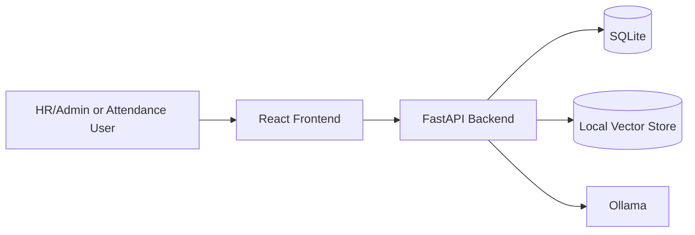

# PeopleMind AI

PeopleMind AI is a local-first HR Intelligence and Management Assistant that combines document intelligence, candidate analysis, attendance operations, and HR reporting in one workspace.

The project is designed around privacy, human review, and local AI processing.

## Current MVP

The current PeopleMind AI MVP includes:

- HR Document Assistant with local RAG and page citations
- CV Intelligence with ATS analysis and job matching
- Attendance Management with reporting and analytics
- Scoped shared attendance accounts
- HR/Admin authentication
- React-based HR Operations Dashboard
- Local AI inference using Ollama

## Core Modules

### Document Intelligence

HR/Admin users can:

- Upload PDF HR documents
- Extract and index document content
- Generate local embeddings
- Search HR documents
- Ask natural-language questions
- Receive grounded answers with source citations
- View cited pages
- Rename and delete documents

The Document Assistant uses Retrieval-Augmented Generation (RAG) so answers can be checked against uploaded source material.

### CV Intelligence

The CV module supports:

- Candidate CV upload
- Structured candidate profiles
- Job profile creation
- Candidate-to-job assignment
- ATS-oriented analysis
- Candidate/job matching
- Ranking and comparison support
- Human review notes

PeopleMind AI provides decision-support information only. Final employment decisions remain with human reviewers.

### Attendance Management

The attendance system includes:

- Team and shift management
- Employee roster management
- Weekly holiday configuration
- Daily attendance submission
- Leave management
- Attendance history
- Attendance analytics
- Monthly employee reports
- CSV export
- Printable reports
- Native PDF export
- Report deletion with audit history

### Shared Attendance Access

Restricted attendance accounts can be configured for:

- A fixed team and fixed shift
- An entire team with active shifts resolved dynamically

Shared attendance users only access their permitted attendance scope.

After attendance is submitted for a date/team/shift combination, the shared account becomes read-only for that submission. HR/Admin can later correct records while the original submission audit remains preserved.

### HR Operations Dashboard

The dashboard displays live application data including:

- Employee count
- Attendance rate
- Candidate count
- Document count
- Attendance status overview
- Workspace summary
- Recent activity
- Quick navigation to major modules

## Architecture



## Technology Stack

### Backend

- Python 3.11
- FastAPI
- SQLAlchemy
- SQLite
- Pydantic
- PyJWT
- pwdlib
- PyPDF
- ChromaDB
- ReportLab
- Pytest

### Frontend

- React 19
- TypeScript
- Vite
- Tailwind CSS
- Axios
- React Router

### Local AI

- Ollama
- qwen3:4b-instruct
- embeddinggemma

## Local Setup

The following commands are intended for Windows PowerShell.

### 1. Clone the Repository

```powershell
git clone https://github.com/Rafi7078/peoplemind-ai.git
Set-Location ".\peoplemind-ai"
```

### 2. Create the Python Environment

```powershell
python -m venv .venv
& ".\.venv\Scripts\python.exe" -m pip install -r requirements.txt
```

### 3. Configure Backend Environment

```powershell
Copy-Item ".\.env.example" ".\.env"
```

Replace the placeholder JWT secret in `.env` with a private random value. Never commit `.env`.

### 4. Install Ollama Models

```powershell
ollama pull qwen3:4b-instruct
ollama pull embeddinggemma
```

### 5. Create the First HR/Admin Account

```powershell
& ".\.venv\Scripts\python.exe" -m backend.app.scripts.create_admin
```

The script prompts for the admin credentials interactively.

### 6. Install Frontend Dependencies

```powershell
Set-Location ".\frontend"
npm.cmd install
Copy-Item ".\.env.example" ".\.env"
Set-Location ".."
```

## Running the Application

### Backend

From the repository root:

```powershell
& ".\.venv\Scripts\python.exe" -m uvicorn backend.app.main:app --reload --host 127.0.0.1 --port 8000
```

Backend: `http://127.0.0.1:8000`

API health: `http://127.0.0.1:8000/api/health`

FastAPI docs: `http://127.0.0.1:8000/docs`

### Frontend

In another PowerShell window:

```powershell
Set-Location ".\frontend"
npm.cmd run dev
```

Frontend: `http://localhost:5173`

## Testing

### Backend Tests

```powershell
& ".\.venv\Scripts\python.exe" -m pytest backend\tests -q
```

### Frontend Lint and Build

```powershell
Set-Location ".\frontend"
npm.cmd run lint
npm.cmd run build
Set-Location ".."
```

### Git Validation

```powershell
git diff --check
git status --short
```

## Security and Privacy

PeopleMind AI follows a local-first development approach.

Local and sensitive assets are intentionally excluded from Git, including:

- `.env`
- SQLite database files
- Uploaded HR documents
- Candidate CV files
- Local vector-store data
- Generated attendance credential files
- Frontend build output
- Node modules

Important security controls include:

- Password hashing
- JWT-based authentication
- HR/Admin-protected routes
- Scoped attendance accounts
- Local credential files excluded from Git
- Attendance submission audit history
- Attendance report deletion audit history

Never commit real passwords, JWT secrets, employee documents, candidate CVs, local databases, or generated credential files.

## Responsible HR Use

PeopleMind AI is designed to assist HR workflows, not replace human decision-makers.

ATS results, job-match scores, candidate rankings, and AI-generated HR document answers should be reviewed by an authorized person before important employment or HR decisions are made.

Final hiring, rejection, promotion, disciplinary, or employment decisions should not be delegated solely to AI output.

## Current Limitations

The current version is a local MVP.

Current limitations include:

- SQLite instead of a production database server
- Local single-instance deployment
- Ollama must be available for AI features
- No enterprise SSO
- No multi-organization tenancy
- No production cloud deployment workflow
- No automated final employment decisions
- No email assistant in the current MVP

## Project Status

The core PeopleMind AI MVP modules are implemented and integrated.

Current backend API version: `0.7.0`

## Documentation

- `docs/MVP_REQUIREMENTS.md`
- `docs/DEMO_GUIDE.md`

## License

No open-source license has currently been specified for this repository.
